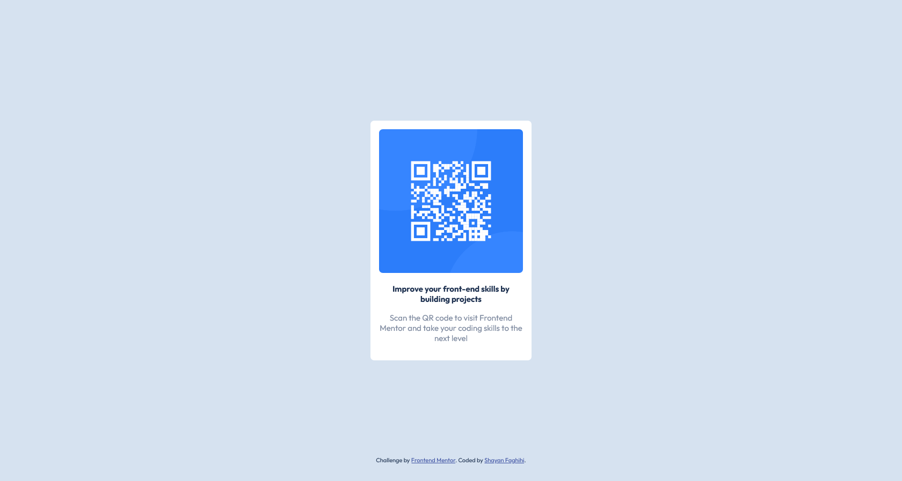

# Frontend Mentor - QR code component solution

This is a solution to the [QR code component challenge on Frontend Mentor](https://www.frontendmentor.io/challenges/qr-code-component-iux_sIO_H). Frontend Mentor challenges help you improve your coding skills by building realistic projects. 

## Table of contents

- [Overview](#overview)
  - [Screenshot](#screenshot)
  - [Links](#links)
- [My process](#my-process)
  - [Built with](#built-with)
  - [What I learned](#what-i-learned)
  - [Continued development](#continued-development)
  - [Useful resources](#useful-resources)
- [Author](#author)
- [Acknowledgments](#acknowledgments)

## Overview
This is just a simple layout for showing how different businesses can show off their landing page using a simple yet shining web page containing a QR Code.

### Screenshot

### Links

- Solution URL: https://github.com/ShayanFaghihi/qr-code
- Live Site URL: https://shayanfaghihi.github.io/qr-code/

## My process
Just started in the middle of the night, and has been finished an hour after that 😁

### Built with

- Semantic HTML5 markup
- CSS custom properties
- Flexbox
- Mobile-first workflow

## Author

- Website - [Shayan Faghihi](https://shayan-faghihi.ir)
- Frontend Mentor - [@ShayanFaghihi](https://www.frontendmentor.io/profile/ShayanFaghihi)
- Twitter - [@Shayan_Faghihi](https://twitter.com/Shayan_Faghihi)
